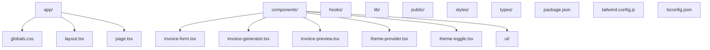

<!-- Animated Invoice Icon -->
<p align="center">
  
</p>

<h1 align="center">Invoice Generator Pro – LekhPatra  </h1>

<p align="center">
  
  
  
  
  
  
</p>

---

> **Create, preview, and download beautiful invoices in seconds.**<br/>
> <b>Modern, animated, and privacy-first invoice generator for freelancers, businesses, and creators.</b>

---

## 🚀 Features

- 🚀 **Instant Invoice Creation** – Fill, preview, and download PDF invoices in seconds.
- 👤 **Sender & Recipient Details** – Add name, email, address, and mobile number for both parties.
- 💸 **Multi-currency & Tax** – Supports any currency, item/invoice discounts, and tax rates.
- 🏦 **Bank/Payment Details** – Add bank name, account, IFSC, SWIFT/BIC, etc.
- 👁️ **Live Preview** – See your invoice update in real-time as you type.
- 📥 **PDF Download** – Download ready-to-send, professional PDF invoices.
- 🎨 **Custom Logo & Branding** – Upload your logo or use the default.
- 🔒 **Privacy-First** – All data stays on your device. No signup, no tracking.
- 📱 **Responsive & Mobile-Ready** – Works beautifully on all devices.
- ✨ **Premium UI/UX** – Built with modern design, smooth animations, and best practices.

---

## 🎬 Animated Demo

<p align="center">
  
</p>

---

## 🧩 How It Works

1.  **Fill Invoice Details** – Enter sender, recipient, items, payment, and notes.
2.  **Live Preview** – Instantly see your invoice update as you type.
3.  **Download PDF** – Click to download a professional invoice PDF.
4.  **Send or Print** – Share or print your invoice, ready for your client.

---

## 💡 Use Cases & Problems Solved

-  **Freelancers** – Bill clients with professional, branded invoices.
-  **Small Businesses** – Generate GST-ready or global invoices in seconds.
-  **Startups & Creators** – Save time, look premium, and get paid faster.
-  **Privacy Advocates** – No data leaves your device. 100% privacy.
-  **Anyone** – Need a quick, beautiful invoice? This is for you.

---

## 🛠️ Tech Stack

| Tech           | Description                | Icon |
|----------------|----------------------------|------|
| Next.js        | React framework            |  |
| React          | UI library                 |  |
| TypeScript     | Type safety                |  |
| Tailwind CSS   | Utility-first CSS          |  |
| jsPDF          | PDF generation             | 📄 |
| html2canvas    | HTML to image for PDF      | 🖼️ |
| Lucide Icons   | Modern SVG icons           | ✨ |

---

## ✨ Why Choose Invoice Generator Pro?

- **No Login, No Signup, No Ads**
- **100% Privacy** – All data is local, nothing is sent to a server.
- **Lightning Fast** – Create and download invoices in seconds.
- **Premium UI/UX** – Modern, animated, and beautiful.
- **Mobile-First** – Works on any device, anywhere.
- **Customizable** – Add your logo, branding, and details.
- **Open Source** – Fork, contribute, or self-host.

---

## 📸 Screenshots

<p align="center">
  
</p>

---

## 📝 Getting Started

1. **Clone the repo:**
   ```bash
   git clone https://github.com/NarenderSD/lekhpatra.git
   cd invoice-generator
   ```
2. **Install dependencies:**
   ```bash
   npm install
   # or
   pnpm install
   ```
3. **Run locally:**
   ```bash
   npm run dev
   # or
   pnpm dev
   ```
4. **Open in browser:**
   [http://localhost:3000](http://localhost:3000)

---

## 🤝 Contribution

- PRs welcome! For major changes, please open an issue first.
- See the [CONTRIBUTING.md](CONTRIBUTING.md) for details.

## 📄 License

This project is licensed under the MIT License.

---

## 🗂️ Project Structure

```plaintext
invoice-generator/
  ├── app/
  │   ├── globals.css
  │   ├── layout.tsx
  │   └── page.tsx
  ├── components/
  │   ├── invoice-form.tsx
  │   ├── invoice-generator.tsx
  │   ├── invoice-preview.tsx
  │   ├── theme-provider.tsx
  │   ├── theme-toggle.tsx
  │   └── ui/
  ├── hooks/
  ├── lib/
  ├── public/
  ├── styles/
  ├── types/
  ├── package.json
  ├── tailwind.config.js
  ├── tsconfig.json
  └── ...
```

> **Note:** To view the diagram below, make sure GitHub's "Markdown: Enable Mermaid" feature is enabled in your profile settings (or use VS Code with Mermaid preview).



---

## 🤝 Connect with Me

[](https://www.linkedin.com/in/narendersingh1/)

---

<p align="center">
  <b>Build by Narender Singh</b> 🚀
</p> 